# Таблица с базой вопросов

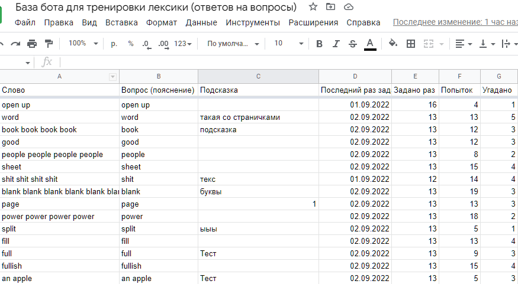

Для пробного запуска [бота для тренировки лексики](https://t.me/vocabulary_coach_bot) решил не мудрить с отдельной базой данных под вопросы. Тем более это потребовало бы интерфейса для загрузки и выгрузк ваших вопросов, синхронизации изменениий и много другого. Если бот будет активно использоваться, то в будущем улучшу этот момент + увеличу скорость работы. А пока нужно развернуть вашу личную таблицу.

- [Зачем эта таблица](#Зачем-эта-таблица)
- [Как сделать копию таблицы и развернуть её](#Как-сделать-копию-таблицы-и-развернуть-её)
	- [Если потеряли ссылку](#Если-потеряли-ссылку)
- [Полезные ссылки](#Ссылки)

## Зачем эта таблица

Эта таблица - **простая база данных** с доступным практически любому пользователю интерфейсом.
Внутри таблицы построчно хранятся вопросы, ответы, подсказка и статистика по использованию.
На основании статистики вы можете сделать графики или отслеживать прогресс. В дальнейшем бот может быть научится отображать статистику в т.ч. на основаннии этих данных.

- Ваши данные всегда доступны вам
- Простой интерфейс для внесения вопросов
- Бот работает на основании данных таблицы

К таблице привязан скрипт, который позволяет боту взаимодействовать с вашей базой.
Вы можете добавлять столбцы, редактировать данные. Однако, есть 2 правила, чтобы всё не сломать:
- **Не изменяйте названия столбцов**, которые есть сейчас
- **Не меняйтес типы данных существующих столбцов**
(где даты должны быть даты, где числа – числа)

## Как сделать копию таблицы и развернуть её
Скорее всего вам потребуется компьютер.
С телефона теоритически это возможно сделать, но удобнее с компьютера.
Эти действия потребуется выполнить только один раз

- [Перейдите по ссылке на страницу с таблицей](https://docs.google.com/spreadsheets/d/1FvD3tg18_Gx9mD71T2cI6UiVrfnZ8ikgp0hAV7GpBeU/edit?usp=sharing)
- Сделайте копию таблицы в ваш аккаунт

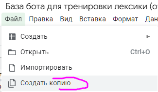
- Обязательно копируйте вместе с файлом Apps Script
- Разместите копию в любое удобное место. С таблицей вам предстоит работать, т.к. база вопросов ведётся в ней. Можете сделать закладку, чтобы быстрее открывать.
- В скорпированной таблице перейдите в редактор Apps Script

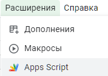
- В редакторе нажмите кнопку "Новое развёртывание"

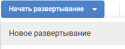
- Если не будет указан, то выберите тип "Веб-приложение"

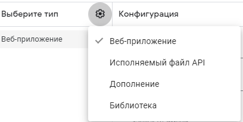
- Установите настройки доступа "все", запуск от вашего имени

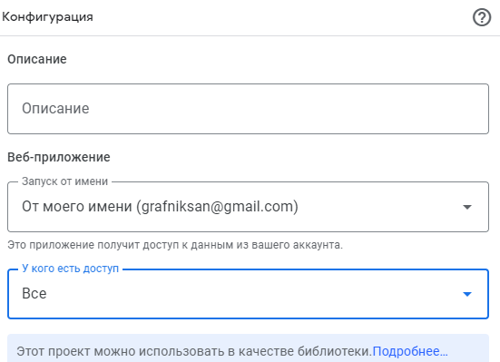
- Нажмите кнопку "Начать развёртывание" и предоставьте доступ скрипту для работы
	- Откроется окно предоставления доступа, выберите аккаунт

	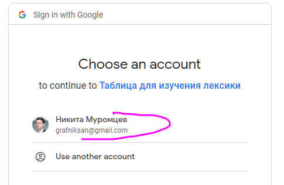
	- Появится предупреждение, что автор скрипта неизвестен, и это небезопасно. Нажмите кнопку слева, будто вы продвинуты пользователь

	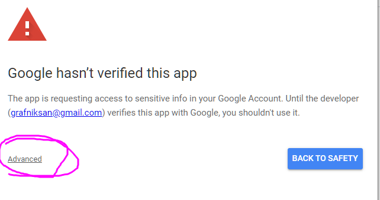
	- Появится дополнительный текст, внизу которого будет ссылка для активации доступа в любом случае

	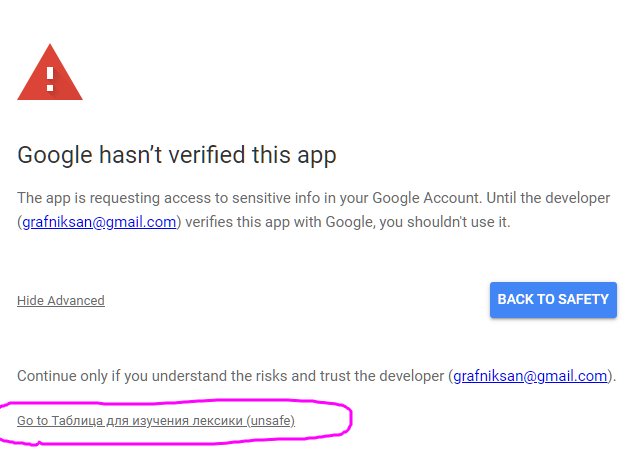
	- Заключительное окошко для подтвержденя работы скрипта, разрешите доступ

	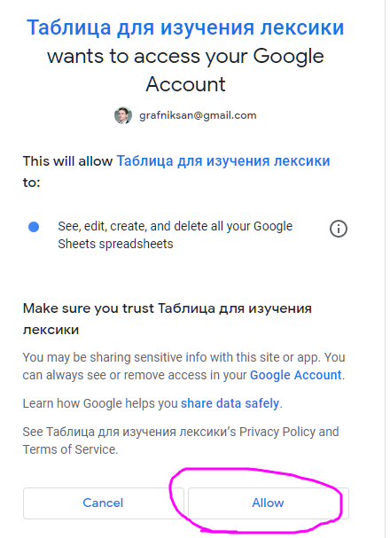
- Скопируйте ссылку, её нужно будет отправить боту для запуска

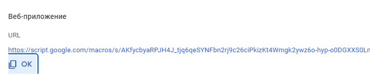
### Что дальше

- Удалите варианты вопросов, которые я оставил для примера
- Введите свои варианты
- Для режима "выбор ответа из списка" нужно минимум 8 слов
- **Не изменяйте названия столбцов**, которые есть сейчас
- **Не меняйтес типы данных существующих столбцов**
(где даты должны быть даты, где числа – числа)
- Удаляйте, редактируйте, добавляйте варианты вопросов

### Если потеряли ссылку
Можно отобразить её заново

- Заходим в управление развёртываниями

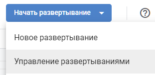
- И там увидите ссылку

## Ссылки
- Бот https://t.me/vocabulary_coach_bot
- Мой телеграм канал https://t.me/etonikmedoed
- [README](../README.md)
